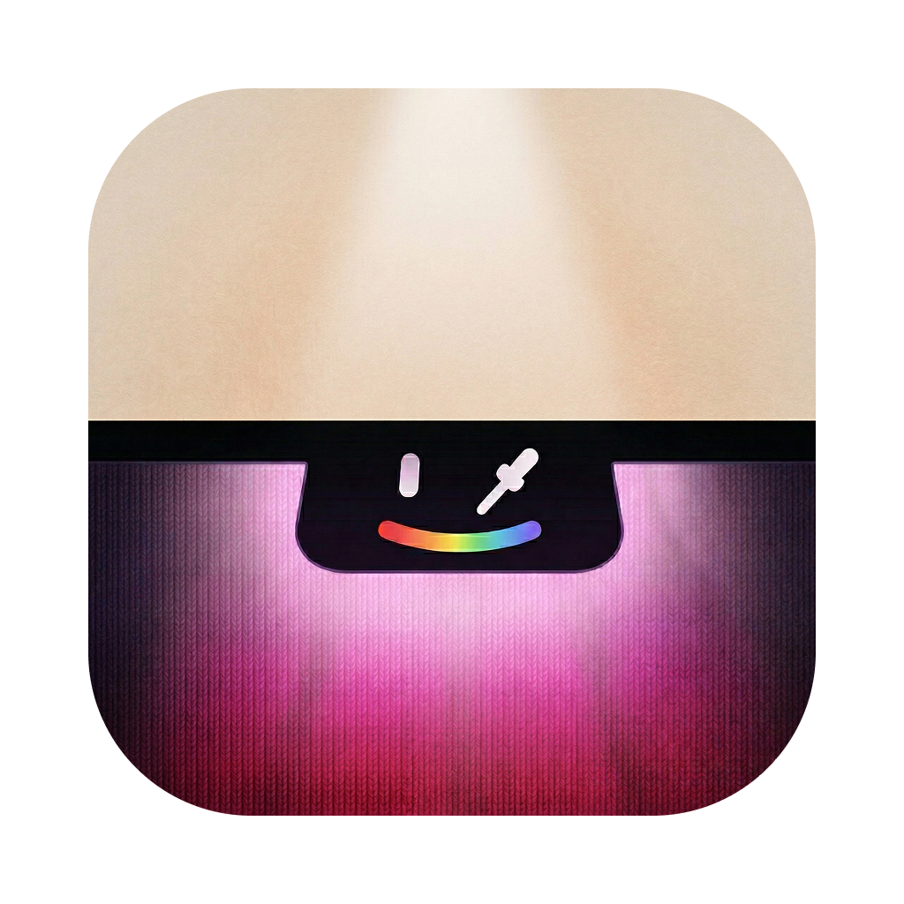

# Peeler

<p align="center">
  <a href="https://peeler.anants.studio"></a>
</p>
<p align="center">
  <!-- <a href="https://github.com/GithubAnant/peeler/releases/latest"></a> -->
  <a href="https://github.com/GithubAnant/peeler/releases"></a>
  <a href="LICENSE"></a>
  <a href="#requirements"></a>
</p>

A lightweight macOS menu bar app for picking colors and extracting palettes from your screen.

## Features

- **Eyedropper** — Pick any color from your screen with a global hotkey
- **Palette extraction** — Select a screen region and extract its dominant colors
- **12 color formats** — Copy as Hex, RGB, HSL, HSB, OKLCH, SwiftUI, NSColor, UIColor, and more
- **Color history** — Browse and re-copy recently picked colors
- **Saved palettes** — Name, organize, and revisit extracted palettes
- **Export** — Export palettes as CSS variables, Tailwind config, JSON, or plain hex

## Requirements

- macOS 13.0+
- Screen Recording permission (the app will prompt you on first use)

## Install

Download the latest DMG from the [Releases](https://github.com/GithubAnant/peeler/releases) page, open it, and drag **Peeler.app** to your Applications folder.

Since Peeler is not notarized, macOS may block it on first launch. To fix this, run:

```bash
xattr -rd com.apple.quarantine /Applications/Peeler.app
```

Then open the app normally.

## Hotkeys

| Action | Shortcut |
|--------|----------|
| Pick a color | `Cmd + Shift + C` |
| Extract palette | `Cmd + Shift + X` |

Right-click the menu bar icon for History, Palettes, Settings, and Quit.

## Build from Source

Requires Xcode 15+ and Swift 6.0.

```bash
# Run in debug mode
swift run

# Build the .app bundle
bash scripts/build-app.sh

# Package into a DMG
bash scripts/create-dmg.sh

# Package a Sparkle update ZIP
bash scripts/create-update-archive.sh

# Generate appcast.xml for published updates
bash scripts/generate-appcast.sh
```

Build output goes to `build/Peeler.app`, `build/Peeler-1.0.0.dmg`, and `build/updates/`.

## Update Pipeline

Peeler now uses Sparkle for in-app updates.

1. Generate an EdDSA key pair with Sparkle's `generate_keys` tool.
2. Replace `SUPublicEDKey` in `Sources/Peeler/Resources/Info.plist` with your public key.
3. Build the app bundle with `bash scripts/build-app.sh`.
4. Create the update ZIP with `bash scripts/create-update-archive.sh`.
5. Run `bash scripts/generate-appcast.sh` to generate `appcast.xml`.
6. Upload the ZIP and `appcast.xml` to the host used by `SUFeedURL`.

By default `SUFeedURL` points to:

`https://github.com/GithubAnant/peeler/releases/latest/download/appcast.xml`

If you host updates elsewhere, change `SUFeedURL` in `Sources/Peeler/Resources/Info.plist`.

## Contributing

Please read [CONTRIBUTING.md](CONTRIBUTING.md) before submitting pull requests.

## License

[MIT](LICENSE)
